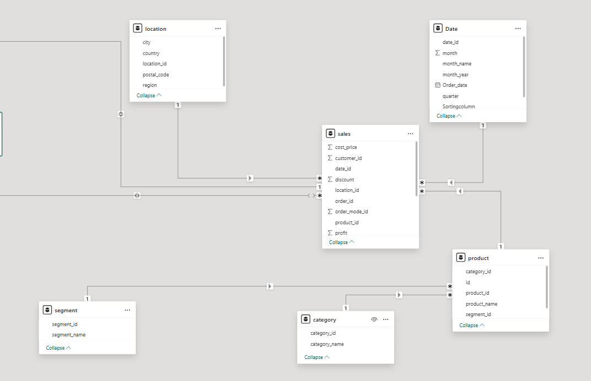

# RDAMP-Dimensional-Model-PowerBI

## Project Title: Dimensional Modeling, SQL Transformation & Power BI Reporting

### Dimensional Schema Overview
To support effective analysis and reporting, a Star Schema was designed and implemented. This schema centralizes transactional data in a fact table and connects it to surrounding dimension tables for descriptive context.

A Star Schema was chosen for its simplicity and query efficiency in business intelligence tools like Power BI.

### Purpose of Fact Table
**fact_sales**: Central table storing all transactional records: sales, cost, quantity, profit, and discount.

### Purpose of Dimentional Table
**dim_product**: Holds product-specific info like name, category, sub-category
**dim_category**: Holds category information. Category id is connected to dim_product table because some products are assiged to multiple category. It's practical in retail environment.
**dim_date**: Enables time-based analysis (month, quarter, year).
**dim_location**:	Location info: city, postal code, region, country.
**dim_order_mode**:	Online vs In-Store order mode, helps analyze channel-based performance.
**dim_customer**:	Holds customer details 
**dim_segment**: Holds segment information. segment_id is connected to dim_product table

### SQL Setup Instructions(MSSQL + SSMS)
**Step 1: Create the Database**
1.Open SQL Server Management Studio (SSMS)

2.Connect to  SQL Server instance

3.create your database

**Step 2: Create Schema (Tables)**: Using create table command

**Step 3: Insert Sample Data**: Populate data using bulk insert command from excel

**Step 4: Create Views**: using create view command for further analysis in power bi

**Summary Folder Structure (for reference)**

###  Connect Power BI to SQL Server
Once SQL is set up, open Power BI Desktop and:

1. Click Get Data > SQL Server

2. Server name: .\SQLEXPRESS 

3. Use Windows Authentication

4. Select database

5. Import views and tables

